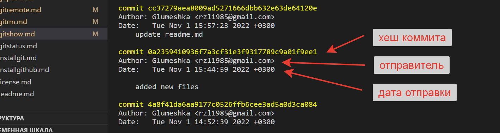

[<-- к содержанию](./readme.md)

---

## Команда __"git show"__
Команада ___git show___ служит для просмотра [__коммитов__](./gitcommit.md).

Способ применения:

* Просмотреть __коммит__ 4a8f41da6aa9177c0526ffb6cee3ad5a0d3ca084 (<--имя хеша):

        git show 4a8f41da6aa9177c0526ffb6cee3ad5a0d3ca084

Хзш можно найти просмотрев [__лог__](./gitlog.md).

---

[<-- к содержанию](./readme.md)