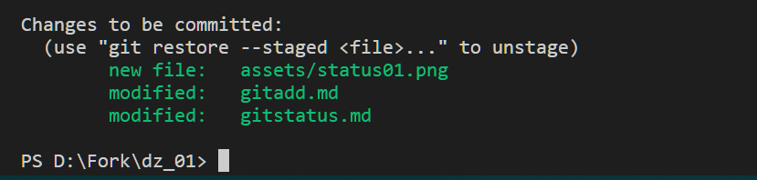

[<-- к содержанию](./readme.md)

---

## Команда __"git status"__
Команада ___git status___ служит для просмотра текущего состояния всех произведенных изменений в нашем проекте.

* вывести текущий статус отслеживаемых фаилов:

        git status

### Возможные статусы

в командной строке различается цветовое оповещение с наименованием файлов и их состояние

к примеру красное выделение:

показывает что, были изменения в файлах _gitadd.md_ и _gitstatus.md_ и эти изменения не входят в [__commit__](./gitcommit.md).

после выполенения команды [__git add__](./gitadd.md) мы видим что:

фаилы стали выделены зеленым цветом, что сообщает нам что они готовы к отправке в [__commit__](./gitcommit.md).

---

[<-- к содержанию](./readme.md)