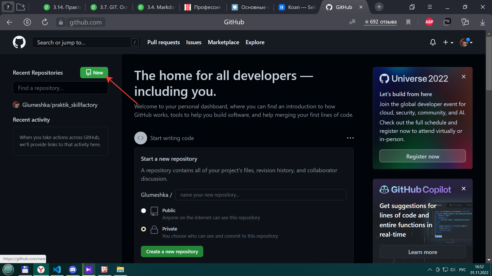

[<-- к содержанию](./readme.md)

---

## Создание удаленного репозитория на  [__GitHub__](https://github.com/)

---

[___Репозито́рий___](https://ru.wikipedia.org/wiki/Репозиторий) (от англ. repository — хранилище) — место, где хранятся и поддерживаются какие-либо данные. Чаще всего данные в репозитории хранятся в виде файлов, доступных для дальнейшего распространения по сети.

Из чего следуюет вывод, что даноое хранилище может быть размещено не только на вашем компьютере, но и на хостинге.

В нашем случае хостингом выступает [__GitHub__](https://github.com/).

Для регистрации на хостинге перейдите по ссылке [__GitHub__](https://github.com/), далее нажмите ___"sign up"___

Далее потребуется ввести свой "email" и подтвердить его на нем же.

Для создания нового репозитория после регистрации жмем ___"New"___

Далее именуем репозиторий, язык английский, имя любое.

__Публичный__ - с общим доступом любому желающему.

__Приватный__ - с доступом для Вас и всем кому будет Вами позволено.

После этого [GitHub](https://github.com/) Вам предлагает список команд для обьединения вашего хранилища на компьютере с удаленным на [GitHub](https://github.com/)

разница только а наличии фаила readme.md при создании репозитория.

При последовательном введении данных команд вы свяжите своё хранилице на компьютере с хранилищем на [GitHub](https://github.com/).

__Важно__ - при первом выполнении команд Вам потребуется пройти авторизацию на сайте, это происходит единожды, но помните что доступ к Вашему рабочему месту посторонних лиц не желателен.

---

[<-- к содержанию](./readme.md)